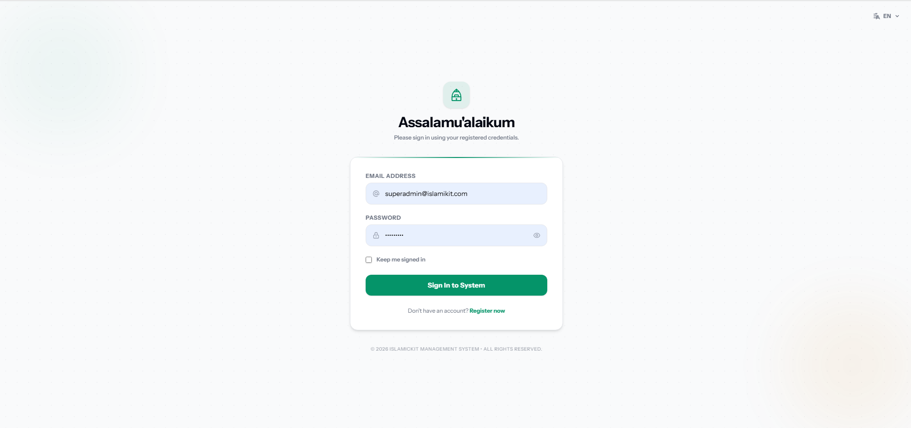
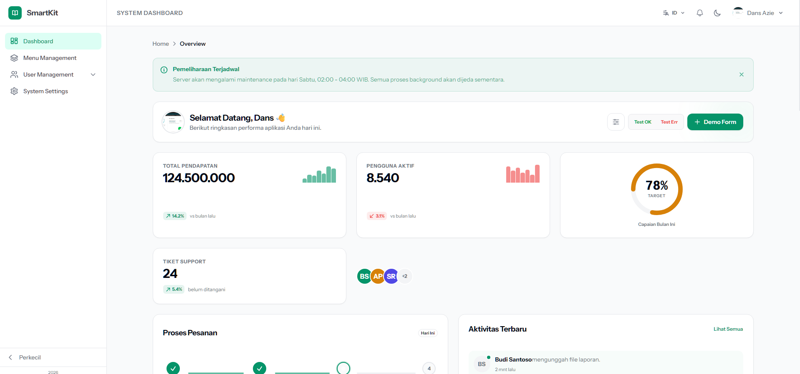
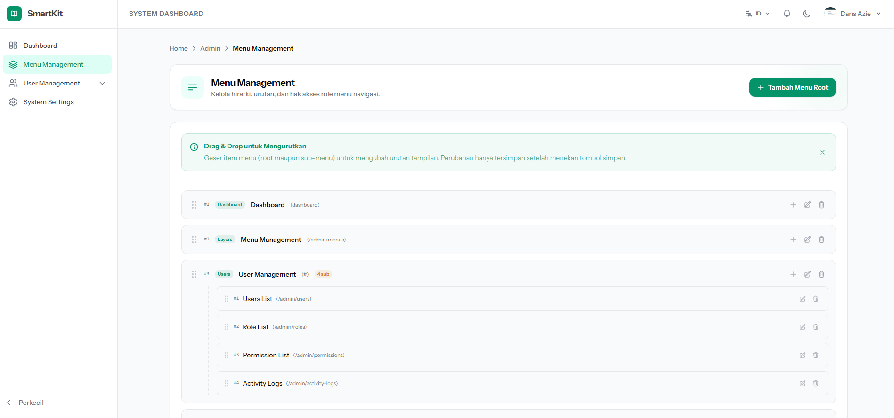
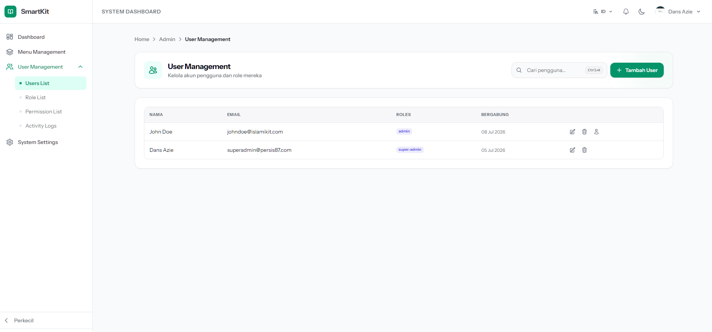
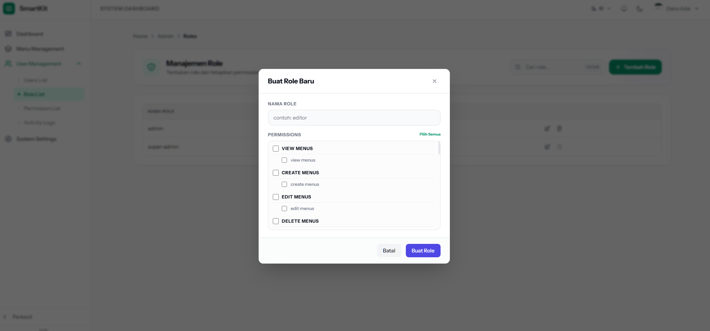
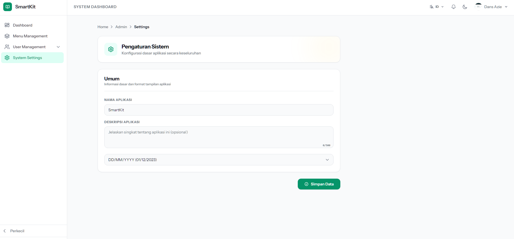
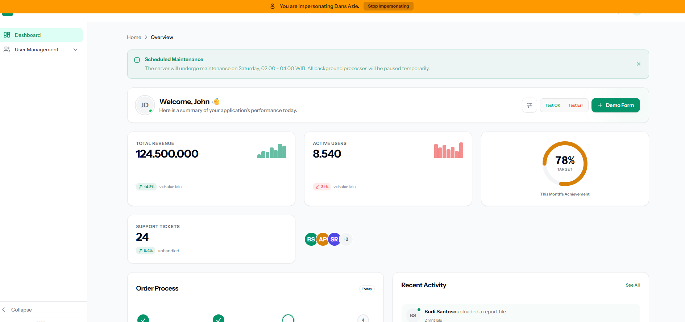

# IslamiKit Starterkit

Laravel 13 starter kit powered by **Inertia.js**, **Vue 3**, **Laravel Fortify**, and **Spatie Packages**.

A modern Laravel starter package providing authentication foundation, permission management, application settings, activity tracking, and reusable Vue components.

---

## Requirements

* PHP >= 8.2
* Laravel 13
* Composer 2
* Node.js >= 20
* NPM

---

# Installation

Install the package using Composer:

```bash
composer require islamikit/starterkit:"^1.0.0"
```

Run the installer:

```bash
php artisan starterkit:install
```

The installer will configure the application automatically.

---

# Installation Process

The installer performs the following tasks:

* Publish Starterkit configuration
* Publish root application view
* Publish CSS assets
* Publish Vue components
* Publish layouts
* Publish pages
* Publish composables
* Update `app.js`
* Update Inertia middleware
* Configure Vite aliases
* Configure Vue and Icon plugins
* Publish Spatie migrations
* Run migrations
* Run package seeders
* Install required frontend dependencies
* Clear application cache

After installation:

```bash
npm run dev
```

---

# Available Options

The installer provides several options:

### Force overwrite existing files

```bash
php artisan starterkit:install --force
```

### Skip migrations

```bash
php artisan starterkit:install --skip-migrate
```

### Skip seeders

```bash
php artisan starterkit:install --skip-seed
```

### Skip npm installation

```bash
php artisan starterkit:install --skip-npm
```

---

# Features

## Laravel Integration

* Laravel 13 support
* Automatic package discovery
* Custom Service Provider
* Installation command

## Authentication

Powered by Laravel Fortify.

Includes:

* Login
* Authentication workflow
* User session management

## Permission Management

Powered by Spatie Laravel Permission.

Includes:

* Roles
* Permissions
* User role assignment

## Activity Tracking

Powered by Spatie Activitylog.

Provides:

* User activity tracking
* Application event logging

## Application Settings

Powered by Spatie Laravel Settings.

Provides:

* Centralized application configuration
* Settings management

## Frontend Foundation

Built with:

* Inertia.js
* Vue 3
* Tailwind CSS
* Vite

Includes:

* Layout system
* Vue components
* Composables
* Pages
* UI components

---

# Published Structure

After installation:

```
resources/
├── css/
│   └── starterkit.css
│
├── js/
│   ├── Components/
│   │   ├── smart/
│   │   └── ui/
│   │
│   ├── Composables/
│   │
│   ├── Layouts/
│   │
│   └── Pages/
│
└── views/
    └── app.blade.php
```

---

# Vite Configuration

The installer configures Vite with:

* Laravel Vite Plugin
* Vue Plugin
* Tailwind CSS Plugin
* unplugin-icons
* Path aliases

Available aliases:

```javascript
@
```

points to:

```
packages/starterkit/resources/js
```

and:

```javascript
@starterkit
```

points to:

```
packages/starterkit/resources/js
```

---

# Screenshots

All screenshots are stored in:

```
packages/starterkit/docs/
```

## Login



---

## Dashboard



---

## Menu Management



---

## User Management



---

## Role & Permission Management



---

## Application Settings



---

## User Interpersonate



---

# Thanks

Special thanks to all open-source projects and maintainers that make this starterkit possible.

## Laravel

Thanks to the Laravel team for providing an elegant and powerful PHP framework.

https://laravel.com

---

## Inertia.js

Thanks to the Inertia.js team for enabling modern single-page application experiences while keeping Laravel routing and controllers.

https://inertiajs.com

---

## Vue.js

Thanks to the Vue.js team for providing a progressive and flexible frontend framework.

https://vuejs.org

---

## Laravel Fortify

Thanks to Laravel Fortify for providing authentication backend functionality.

https://laravel.com/docs/fortify

---

## Spatie Packages

Special thanks to Spatie for maintaining high-quality Laravel packages:

* Laravel Permission
* Laravel Activitylog
* Laravel Settings

https://spatie.be/open-source

---

## Tailwind CSS

Thanks to the Tailwind CSS team for providing a utility-first CSS framework.

https://tailwindcss.com

---

## Vite

Thanks to the Vite team for providing a fast and modern frontend build tool.

https://vitejs.dev

---

## unplugin-icons

Thanks to the unplugin-icons contributors for providing automatic icon integration.

https://github.com/unplugin/unplugin-icons

---

# Repository

GitHub:

https://github.com/dansazie/islamikit

---

# License

This package is open-sourced software licensed under the MIT license.
